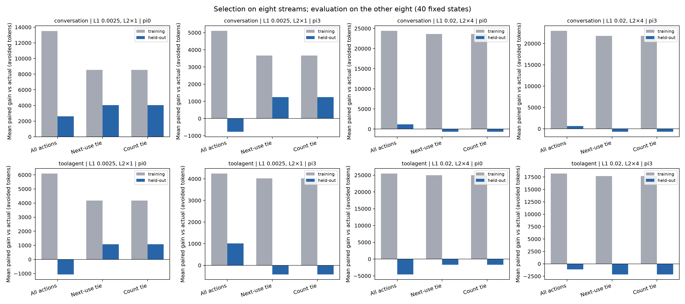
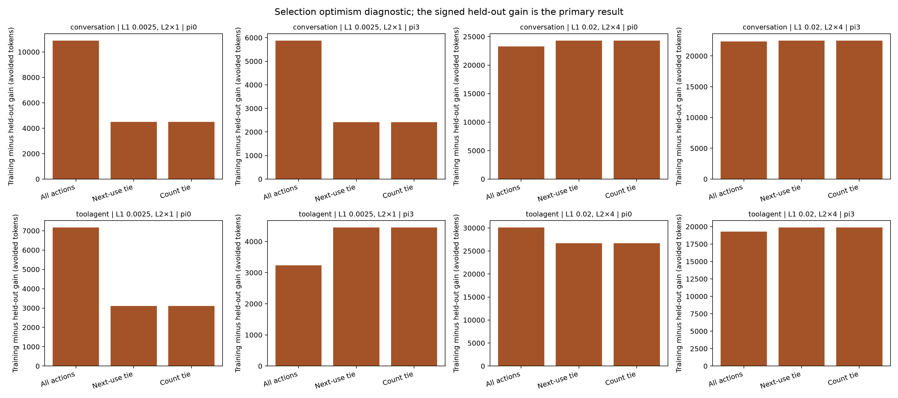

# Fresh continuation randomness and hindsight: findings

This is the result of the [pre-registered randomness experiment](counterfactual-randomness-plan.md). It asks whether the action-value differences seen in the earlier [one-step counterfactual study](counterfactual-action-value-findings.md) persist when an action is selected on one set of future L2 sampling streams and evaluated on another. The future request trace and the sampled simulator state stay fixed. The primary reward is avoided prefill tokens in `(t, t + 600 s]` after forcing one eviction action and then resuming the source policy. The secondary trace-end reward evaluates **the same actions selected using 600-second rewards**.

## Fixed population and integrity

The population is the first hash-ranked state from each of 40 original lineages: conversation and tool-agent traces, 0.25%×1 and 2%×4 L1/L2 cells, source policies pi0 and pi3, and five lineage seeds per stratum. These are 40 states with 678 legal actions. Each action received the same 16 fresh, post-draw continuation seeds within its state, yielding 10,848 fresh action/stream branches. Another 40 captured-RNG actual-action branches served only as validation and did not enter estimation. The old captured and three-stream sensitivity continuations were excluded from the new estimate. The [run config](../results/paper/counterfactual_randomness_001/run_config.json) records the frozen source and plan hashes, folds, complete 40/40 lineage status, 10,888 total branches, and no failed lineages. All 15 retained output files match its SHA256 entries. The original candidate order, source policy, replay boundary, and 600-second window were retained.

The [paper output index](../results/paper/counterfactual_randomness_001/README.md) identifies every table. In particular, [action_stream.csv](../results/paper/counterfactual_randomness_001/action_stream.csv) retains each fresh action/stream outcome, [directional.csv](../results/paper/counterfactual_randomness_001/directional.csv) retains selection and conditional intervals, [heldout_stream.csv](../results/paper/counterfactual_randomness_001/heldout_stream.csv) retains every paired evaluation difference, and [state_crossfit.csv](../results/paper/counterfactual_randomness_001/state_crossfit.csv) and [stratum_summary.csv](../results/paper/counterfactual_randomness_001/stratum_summary.csv) contain the primary summaries.

## Primary held-out result

Streams 1–8 were fixed as fold A and 9–16 as fold B. Within each state, the action with the largest mean 600-second `Q` on A was evaluated against the original action on each B stream, and vice versa. Training-mean ties used the pre-registered live last-group and candidate-draw order. Negative gains remain negative. The primary state statistic is the equal average of the two directional held-out means. It describes an **eight-stream selection procedure**, possibly selecting different actions in the two directions; it does not estimate the value of the true best expected-`Q` action.

Each row below contains five states. Gains are mean paired avoided-prefill-token differences versus the original action; signs count positive / zero / negative state-level symmetric gains. The exact next-use and count minimum-label tie sets and selected actions coincide at all 40 states, so their identical rows are shown once.

| Trace | Cell | Source | All candidates: held-out gain | All: signs | Exact tie: held-out gain | Tie: signs |
|---|---|---|---:|---:|---:|---:|
| Conversation | 0.25%×1 | pi0 | +2,617.6 | 3 / 0 / 2 | +4,038.4 | 5 / 0 / 0 |
| Conversation | 0.25%×1 | pi3 | −768.2 | 2 / 0 / 3 | +1,252.4 | 2 / 1 / 2 |
| Conversation | 2%×4 | pi0 | +1,166.2 | 3 / 0 / 2 | −666.7 | 2 / 0 / 3 |
| Conversation | 2%×4 | pi3 | +626.0 | 2 / 0 / 3 | −692.7 | 3 / 0 / 2 |
| Tool-agent | 0.25%×1 | pi0 | −1,073.5 | 1 / 0 / 4 | +1,076.5 | 2 / 0 / 3 |
| Tool-agent | 0.25%×1 | pi3 | +1,010.9 | 3 / 0 / 2 | −428.6 | 3 / 0 / 2 |
| Tool-agent | 2%×4 | pi0 | −4,613.3 | 1 / 0 / 4 | −1,691.1 | 2 / 0 / 3 |
| Tool-agent | 2%×4 | pi3 | −1,107.9 | 2 / 0 / 3 | −2,166.2 | 1 / 0 / 4 |

Across the 40 equally weighted states, unrestricted selection gained **+15,003.0 tokens on its training folds** but **−267.8 tokens on held-out folds** (17 positive, 23 negative states). Exact-tie-restricted selection gained +13,567.2 on training folds and +90.3 on held-out folds (20 positive, one zero, 19 negative). The paired unrestricted-minus-tie contrasts are retained in [state_contrasts.csv](../results/paper/counterfactual_randomness_001/state_contrasts.csv); neither selector wins every stratum. The near-zero pooled descriptive held-out means, sign mix, and large train-to-held-out drop show that in-sample selection on these continuations substantially overstates gain that transferred to the other eight streams. They do **not** show that all persistent action-value differences are absent.

The per-direction approximate conditional 95% t intervals include zero in 77/80 unrestricted and 76/80 exact-tie evaluations. Each uses eight held-out streams for a selected action and fixed state; it is neither a simultaneous statement nor a confidence interval for the two-direction symmetric statistic. The folds reuse streams in opposite selection/evaluation roles. No formal workload-level significance follows from these intervals or the state sign counts.

## Fixed selectors and hindsight diagnostics

On the same 40 states and 16 streams, the fixed exact next-use and exact-count selectors make identical choices and average **+2,350.1 tokens** versus the original action across 640 paired state/stream rows. Fixed LRU averages +2,503.5 and LFU +851.8 tokens in the same one-action-fork comparison ([fixed_selectors.csv](../results/paper/counterfactual_randomness_001/fixed_selectors.csv)). Exact uses future request knowledge and is a comparator, not a deployable selector. These fixed-action gains do not measure the trace-wide utility of running any of those policies; every branch resumes its original pi0 or pi3 policy after one forced choice.

The [state diagnostics](../results/paper/counterfactual_randomness_001/state_diagnostics.csv) also distinguish the mean of the stream-specific maximum `Q600` from the maximum of the 16-stream action means. Their difference averages +27,226.3 tokens and is positive in all 40 states. This finite-sample hindsight/Jensen gap measures the value of choosing a different observed winner within each stream relative to fitting one winner to all 16 observed streams. Even the all-stream winner is selected on its evaluation data. Neither quantity is a held-out gain, a recoverable trace-wide token total, or a fraction of old regret attributable to randomness. [Stream hindsight](../results/paper/counterfactual_randomness_001/stream_hindsight.csv) and [action-wise variation](../results/paper/counterfactual_randomness_001/actionwise.csv) remain separate diagnostics.

The predeclared trace-end evaluation of the 600-second-selected actions gives descriptive pooled held-out means of +238.2 tokens for unrestricted selection and +292.4 for the exact tie ([stratum summaries](../results/paper/counterfactual_randomness_001/stratum_summary.csv)). These are not separately optimized trace-end choices; signs and magnitudes vary by stratum.

## Interpretation boundary

This experiment weakens an interpretation of the earlier captured-stream hindsight maxima as stable, selectable gains. It leaves the equality or ordering of expected `Q` unresolved: eight training streams can choose poorly, eight evaluation streams give imprecise conditional estimates, and some fixed or stratum-specific comparisons remain positive. The 40 selected states represent five seeds in each stratum, with shared future requests; pi0 and pi3 produce different state populations. Results are conditional on these previously inspected fixed traces, states, continuation model, source policies, and horizons. They do not provide independent-workload inference, a deployable future-informed selector, a new-policy result, a semantic-signal requirement, or a percentage such as “93% of regret is noise.” The separate [old three-stream post hoc audit](counterfactual-randomness-reanalysis.md) remains a different calculation. No automatic next experiment or gate follows from this result.

