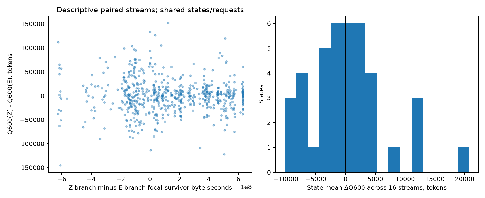
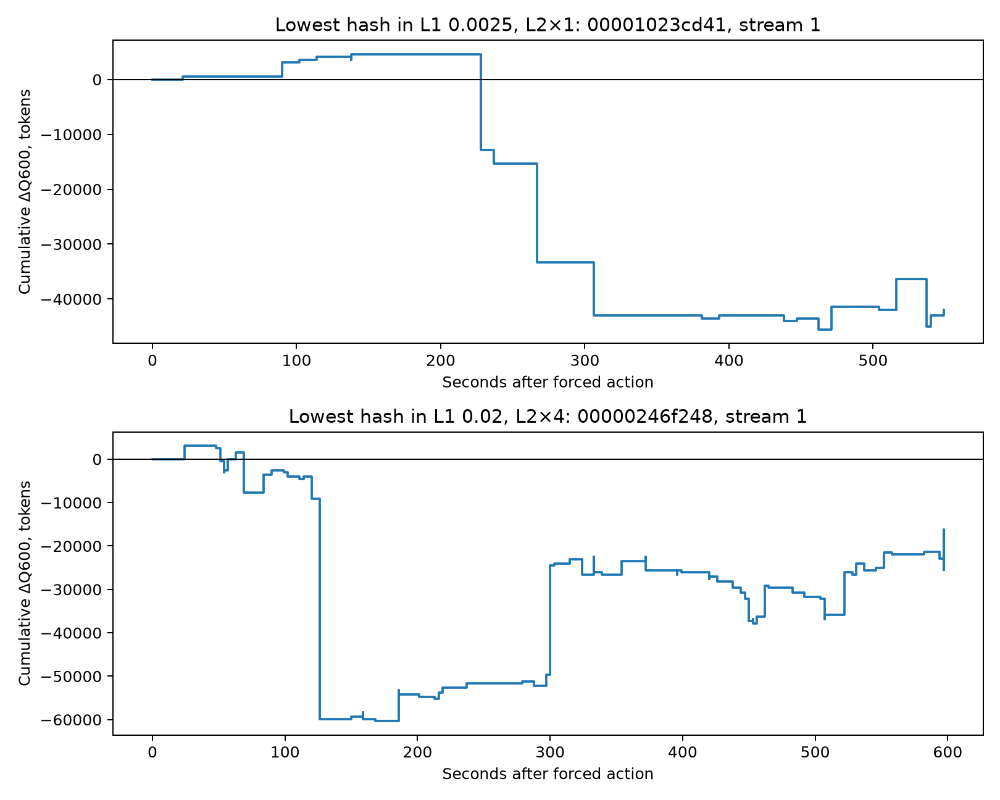

# Zero-own-reuse residence and downstream divergence

This [pre-registered diagnostic](counterfactual-residence-plan.md) follows the [fresh-stream randomness study](counterfactual-randomness-findings.md). It asks whether the realized difference between two actions whose evicted states have **no own reuse within 600 seconds** has a simple residence-time explanation. It replays the same frozen states and streams with read-only event telemetry. It does not add an independent sample of `Q`, fit a model, or introduce a policy.

## Frozen comparison and integrity

The first hash-ranked snapshot from each of 40 lineages was retained: two real traces, 0.25%×1 and 2%×4 L1/L2 cells, pi0/pi3 source policies, and five lineage seeds per stratum. E evicts the published fixed exact-next-use choice from the zero-count tie, using the original `(last_group, candidate index)` minimum. Z evicts the opposite tie endpoint, the maximum of that tuple. The two actions are distinct at all 40 states; neither evicted state is requested in `(t,t+600s]`. Every E/Z action was continued under the unchanged source policy on the same 16 post-draw RNG streams, producing 1,280 instrumented branches and 640 paired state-stream outcomes. The trace, sampling mechanism, candidate sets, and action boundary were unchanged.

All 40 parent replays reproduced the frozen captured parent reward and terminal state. All 1,280 instrumented branch rewards, including the per-request reward digest, exactly matched the hash-verified prior branches. Per-request increments sum to each branch's `Q600` and trace-end `Q`; paired total-token and L2-only differences agree. The [run config](../results/paper/counterfactual_residence_001/run_config.json) records the plan/source and prior-run hashes, full 40/40 status, no failed lineage, and the checksums of the lightweight [CSV and figures](../results/paper/counterfactual_residence_001/README.md). Full event logs remain in ignored raw results.

To reproduce the telemetry, `--source-root` must contain the ignored frozen `results/counterfactual_randomness_001/` dump and its original trace/model/population files as well as the published paper inputs. A paper-only clone cannot regenerate the full run. With those inputs and the committed code, run `prepare`, `smoke`, `full`, then `aggregate` using `scripts/run_counterfactual_residence.py`, the same `--source-root`, and a fresh `--output-dir`; `aggregate` additionally accepts `--paper-dir`. The complete event dump is about 15 GB, while the committed paper output is under 1 MB.

## Observations

The paired difference `ΔQ = Q600(Z) − Q600(E)` averages **+305.3 tokens** over 40 equal-weight states; 20 state means are positive and 20 negative. Across the 640 paired streams, 328 differences are positive, two zero, and 310 negative. Only one state has the same sign in at least 12 of its 16 streams; none has one sign in all 16. The eight five-state stratum means range from **−3,447.6 to +3,950.3 tokens**. This fixed opposite tie-break does not show a stable advantage in these states. A state/stream pair is not an independent workload, and this descriptive mean is not a trace-wide gain.

Both focal blocks cost exactly **1 MiB** under the packed-size proxy in all 640 pairs, and every initial admission required one overflow round. Thus unequal focal block size or an extra initial overflow round does not explain this particular E/Z comparison. The branch difference still changes how long the surviving zero-own-reuse block occupies L2. Its difference in 600-second byte-seconds has no clear monotonic association with `ΔQ`: descriptive Spearman is **−0.029** across paired streams, **−0.090** across 40 state means, and median **−0.087** within the 39 states where both quantities vary across streams. The scatter below shows the sign mix. Residence is a post-action observation; these correlations are neither a randomized mediation estimate nor a test that occupancy is irrelevant.

Every pair develops a different L2 hit within 600 seconds; the first such request is at a median of **24 seconds** after the forced action. The first subsequent L2 eviction/rejection sequence differs **before** that hit difference in 629/640 pairs and in the same timestamp group in 11/640. This ordering records a downstream decision change before the first reward change. It does not prove that the later eviction, rather than the changed resident set itself, caused the hit.

In **497/640** pairs both focal blocks leave L2 before 600 seconds. Of those, **491/497** still have nonzero per-request reward differences after both first-residence episodes end. The absolute reward difference formed after that point exceeds the amount formed before in **351/497** pairs. The post-removal interval is often longer—the median later of the two removal times is 189 seconds after the action—so this fraction must **not** be read as a percentage of causal contribution. In 478/497 pairs the first hit difference already occurred before both blocks left: effects begin during residence and commonly continue afterward. The deterministic examples below show this accumulation, not a typical or recoverable benefit.

The scatter says that longer relative focal residence is not a simple monotone explanation of the realized E/Z reward difference in this fixed set. It cannot establish that occupancy has no effect, because branch trajectories and continuation RNG consumption are also changed. The histogram shows mixed **state-level** mean effects; it is not a workload confidence interval.

These are stream 1 for the lowest selection hash in each capacity regime, selected by identity before inspecting new telemetry. Both happen to be conversation/pi0 states. They show multiple later positive and negative reward increments. Two trajectories cannot establish the frequency or size of the mechanism across workloads; the CSV carries all 640 paired results.

## Interpretation boundary

The simplest **scalar** account—same-size zero-reuse blocks have value determined mainly by how many byte-seconds the alternative survivor occupies—does not describe these realized paired outcomes well. The event ordering and continued differences after focal removal make downstream cache decisions relevant to the realized trajectory. They do **not** quantify a mediated fraction of `Q`, prove a stable expected-action ordering, or show that complex state-conditioned control is necessary. The same 16 continuation streams were already used in the randomness study; there is no new independent confirmation of expected `Q`. Exact equality of ordered L2 contents and RNG state was not measured, so no causal rejoining claim is made. Trace-end values are secondary, and two focal states may be reused after the 600-second window. The result remains conditional on the two Mooncake traces, 40 selected states, sampled-width-16 L2 mechanism, fixed future requests, and frozen pi0/pi3 continuations.

This completes the pre-registered simple-residence step. The separate label-representation/sampling control remains unexecuted. No new policy or semantic feature follows automatically from these data.
