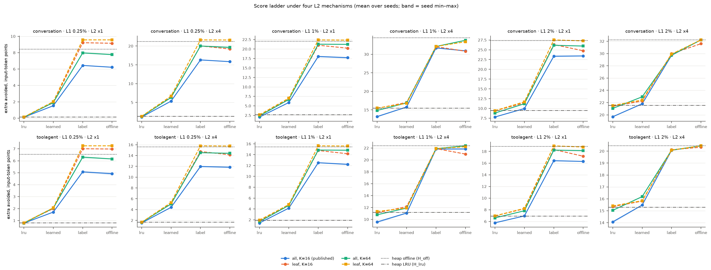
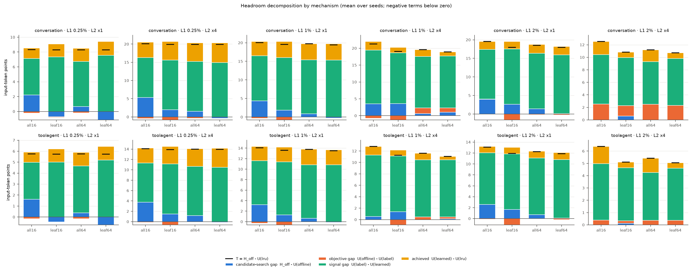

# Mechanism control: a fixed score ladder under four L2 eviction mechanisms

This [pre-registered control](mechanism-control-plan.md) holds the L2 score fixed at four rungs — sampled LRU, the frozen learned `next_use` ranker (pi0), the exact training label of that ranker, and the heap offline comparator's own key — and varies only the mechanism that applies it: eligibility `all` (published) or `leaf`, at sample width 16 or 64. It asks where the published headroom `T = H_off − U(lru)` is lost. Nothing is fitted, no feature or target is added, and leaf-only eligibility is a control, not a proposed policy.

## Run and integrity

The plan was committed alone (`3052319`), the implementation and tests before any real replay of the new arms (`0e99306`), and the full grid ran once from a clean tree at that commit: 2 traces × 6 cells × 4 mechanisms × 4 rungs × 5 seeds = **960 replays**, 57 minutes on 20 workers. The smoke run (conversation, 1%×4, seed 0) is excluded from every table.

All required checks passed and are recorded in the [run config](../results/paper/mechanism_control_001/run_config.json):

- `all16`/`lru` reproduces the 60 published `lru_s` rows and `all16`/`learned` the 60 published `A_none`/`next_use` rows exactly (`avoided_prefill_tokens`; 60 matched, 0 missing, 0 mismatched each).
- All 480 leaf replays have zero present-but-unusable tokens and blocks.
- `l1_avoided_tokens`, `requested_tokens` and the compulsory-absent charge are identical across the 16 arms of each of the 60 trace × cell × seed groups; the per-block absent charge has 0 unexplained tokens.
- The heap references `H_off` and `H_lru` are the published rows, matched on identifiers (60 cell-seeds, 0 problems), not rerun.
- The four terms sum to `T` in exact integer tokens in all 240 seed rows.

Every number below is a column of the [published CSVs](../results/paper/mechanism_control_001/README.md) or simple arithmetic on them, printed by

```bash
.venv/bin/python scripts/tabulate_mechanism_control.py results/paper/mechanism_control_001 \
  --references results/paper/decision_population_replay_seeds.csv
```

To rerun the grid, check out `0e99306` with the ignored traces and the frozen pi0 models of `results/onpolicy_full_feb30eb_001/` in place and run `scripts/run_mechanism_control.py` into a fresh output directory; the runner refuses a dirty tree and an existing directory.

Units: `U` is extra avoided prefill tokens over L1 alone, in points of window input tokens. Means are over five sampling seeds; "consistent" means the same sign in all five seed-paired values. Seed spread describes sampling-seed variability on fixed traces only.

## Reading 1 — dominant gap under the published mechanism

Under `all16`, the **signal gap** `U(label) − U(learned)` holds at least half of `T` in **12/12** trace × cell, and in every one of the 60 seeds taken separately. No cell reads mechanism-bound or objective-bound.

| Trace · cell | `H_off` | `U(lru)` | `U(learned)` | `U(label)` | `U(offline)` | `T` | candidate-search | objective | signal | achieved |
|---|---:|---:|---:|---:|---:|---:|---:|---:|---:|---:|
| conversation 0.25%×1 | 8.427 | 0.117 | 1.522 | 6.444 | 6.223 | 8.310 | 26.5% | −2.7% | **59.2%** | 16.9% |
| conversation 0.25%×4 | 21.190 | 1.114 | 5.346 | 16.306 | 15.844 | 20.076 | 26.6% | −2.3% | **54.6%** | 21.1% |
| conversation 1%×1 | 22.065 | 2.035 | 5.895 | 18.027 | 17.704 | 20.030 | 21.8% | −1.6% | **60.6%** | 19.3% |
| conversation 1%×4 | 34.428 | 13.205 | 15.785 | 31.716 | 30.929 | 21.223 | 16.5% | −3.7% | **75.1%** | 12.2% |
| conversation 2%×1 | 27.369 | 7.820 | 9.972 | 23.357 | 23.430 | 19.549 | 20.2% | 0.4% | **68.5%** | 11.0% |
| conversation 2%×4 | 32.230 | 19.696 | 21.809 | 29.714 | 32.230 | 12.534 | 0.0% | 20.1% | **63.1%** | 16.9% |
| toolagent 0.25%×1 | 6.537 | 0.780 | 1.707 | 5.074 | 4.920 | 5.757 | 28.1% | −2.7% | **58.5%** | 16.1% |
| toolagent 0.25%×4 | 15.593 | 1.524 | 4.414 | 11.976 | 11.835 | 14.068 | 26.7% | −1.0% | **53.8%** | 20.5% |
| toolagent 1%×1 | 15.448 | 1.403 | 4.156 | 12.514 | 12.223 | 14.045 | 23.0% | −2.1% | **59.5%** | 19.6% |
| toolagent 1%×4 | 22.373 | 9.564 | 11.068 | 21.821 | 21.842 | 12.808 | 4.1% | 0.2% | **84.0%** | 11.7% |
| toolagent 2%×1 | 18.855 | 5.768 | 6.950 | 16.416 | 16.286 | 13.086 | 19.6% | −1.0% | **72.3%** | 9.0% |
| toolagent 2%×4 | 20.449 | 14.065 | 15.480 | 20.071 | 20.449 | 6.383 | 0.0% | 5.9% | **71.9%** | 22.2% |

The four right-hand columns are shares of the five-seed mean `T`. The signal gap is positive in 5/5 seeds in every cell.

Read directly: through the published mechanism — the arrival plus 16 uniformly sampled residents, any of which may leave — a perfect predictor of the ranker's own training target reaches 76.5–98.2% of the heap offline reference, while the frozen ranker obtains 11.1–27.9% of the label rung's gain over sampled LRU. The published sampled mechanism does not prevent a good score from becoming utility on these traces; most of the headroom it leaves is between the ranker and its label.

The candidate-search gap is 0–28.1% of `T`: largest in the cells whose L2 is at most 1% of the working set, zero at 2%×4. The objective gap is within ±3.7% of `T` except at 2%×4 (20.1% conversation, 5.9% tool-agent), where the label's 600-second clip costs against the unclipped next use.

## Reading 2 — mechanism effect on each rung

Seed-paired differences of `U`, read per trace × cell as consistent gain / consistent loss / mixed (12 rows per entry; range of the cell means in points).

| Contrast | `lru` | `learned` | `label` | `offline` |
|---|---|---|---|---|
| `leaf16 − all16` | 12 gain (+0.02…+2.21) | 12 gain (+0.29…+1.45) | 12 gain (+0.05…+3.73) | 8 gain, 3 loss, 1 mixed (−0.85…+3.36) |
| `all64 − all16` | 10 gain, 2 mixed (0.00…+1.66) | 12 gain (+0.34…+1.24) | 11 gain, 1 mixed (+0.02…+3.71) | 10 gain, 2 mixed (0.00…+3.79) |
| `leaf64 − leaf16` | 7 gain, 1 loss, 4 mixed (−0.04…+0.22) | 9 gain, 2 loss, 1 mixed (−0.26…+0.30) | 9 gain, 2 loss, 1 mixed (−0.06…+1.60) | 12 gain (+0.12…+2.57) |
| `leaf64 − all16` | 12 gain (+0.02…+2.29) | 12 gain (+0.36…+1.73) | 11 gain, 1 mixed (+0.02…+5.33) | 10 gain, 2 mixed (0.00…+5.77) |

- Leaf-only eligibility at width 16 is a consistent gain for the three rungs that order by recency or by the clipped label, in every cell on both traces. The harm the plan anticipated at small capacity (leaf eligibility protects an arrival with a resident child, as Phase 1's `direct_child` arm did) did not appear for these rungs.
- The size of the eligibility effect depends on the score. In the four cells whose L2 is at most 2% of the working set (0.25%×1, 0.25%×4, 1%×1, 2%×1), `leaf16 − all16` is +0.02…+1.58 for `lru`, +0.29…+1.45 for `learned`, and +1.91…+3.73 for `label`. At 1%×4 and 2%×4 it is the reverse: +1.28…+2.21 for `lru` and +0.05…+0.35 for `label`.
- Losses that hold on both traces: `leaf16 − all16` for `offline` at 2%×4 (−0.62, −0.12), `leaf64 − leaf16` for `learned` at 1%×4 (−0.26, −0.23) and for `label` at 2%×4 (−0.06, −0.03). All are under one point.
- Once eligibility is leaf-only, widening 16 → 64 moves `lru` by at most 0.22 points.

## Reading 3 — ladder order

`lru ≤ learned ≤ label ≤ offline` holds in all five seeds in **2/12** trace × cell under `all16`, 2/12 under `leaf16`, 4/12 under `all64` and 6/12 under `leaf64`. Every one of the 34 listed inversions is the top pair: the exact label scores **above** the offline key (`label > offline`). `lru ≤ learned` and `learned ≤ label` hold in all 240 mechanism × cell × seed rows; the learned rung is never above its label and never below LRU.

By the pre-registered rule (an inversion present under `all16` that is absent under a leaf mechanism in the same cell on both traces is mechanism-borne; one present under all four mechanisms on both traces is a property of the score):

- 0.25%×4, 1%×1 and 2%×1: present under all four mechanisms on both traces → **property of the score** in those cells.
- 0.25%×1 and 1%×4: present under `all16`, absent under `leaf64` on both traces → **mechanism-borne** by the rule. The rule does not separate eligibility from width, and here width does the removing: under `leaf16` the same inversion is present in 5/5 seeds on both traces and is larger at 1%×4 (−1.25, −0.91 against −0.79 and a 1/5-seed +0.02 under `all16`), and at 1%×4 it is already absent under `all64`.
- 2%×4: no inversion under any mechanism.

The inversions are small against `T`: the mean `offline − label` difference is between −0.79 and +0.07 points under `all16` and at most −1.59 under `leaf16`. They say that under sampling, the clipped label with its recency tie-break is not a worse key than the unclipped next use with the heap's prefix tie-break in most cells; they do not rank the two targets in general, because the two rungs differ in tie-break as well as in clipping.

## Reading 4 — the learned arm once the mechanism is controlled

Under `leaf64` the reading is again signal-bound in **12/12** cells and in all 60 seeds. The signal gap holds 69.9–91.1% of `T`, the achieved part 5.2–27.1%, the candidate-search gap −13.7…+5.5%, and the objective gap −1.7…+7.2% except conversation 2%×4 (21.7%).

Controlling the mechanism does not shrink the distance between the ranker and its label. Relative to `all16`, the signal gap in points is larger under `leaf64` in the eight cells other than 1%×4 and 2%×4 (+1.24…+3.98, 5/5 seeds each) and smaller in those four (−0.35…−0.76, 5/5 seeds): where the mechanism has something to give, the label rung collects more of it than the learned rung does.

## Reading 5 — capacity pattern (descriptive)

`U(learned) − U(lru)` and `U(label) − U(lru)` are consistent gains in all 48 trace × cell × mechanism rows. There is no sign change across capacity under `all16` for the frozen pi0 ranker, so there is none to persist or vanish under `leaf`. This run does not contain the arms whose capacity reversal motivated candidate A of the [handoff](strategy-handoff-20260927.md) (the pi3 − pi0 update and arrival protection), and says nothing about them.

## Observations outside the five readings

These were not pre-registered as readings. They are computed from the same published CSVs and are descriptive.

**The achieved part depends on the baseline mechanism.** Under `all16`, sampled LRU is below the published heap LRU by up to 2.27 points (conversation 1%×4); under either leaf mechanism it is within 0.18 points of heap LRU in every cell. The learned arm's margin over LRU therefore changes with the mechanism, and the direction depends on capacity: `achieved(leaf64) − achieved(all16)` is positive in 5/5 seeds at 0.25%×1 and 0.25%×4 on both traces (+0.33…+1.15) and negative in 5/5 seeds at 1%×4 and 2%×4 on both traces (−0.93…−1.31). At 2%×4 the frozen ranker's margin over LRU falls from 2.11 to 0.90 points (conversation) and from 1.42 to 0.44 (tool-agent). Against heap LRU, the frozen ranker under the published mechanism stands at +0.32 / +0.25 (conversation 1%×4, 2%×4) and −0.09 / +0.18 (tool-agent).

**The heap offline reference is exceeded at the smallest cells.** `U(offline)` under `leaf64` is above `H_off` in 5/5 seeds at 0.25%×1 (+1.139 conversation, +0.715 tool-agent), 0.25%×4 (+0.420, +0.160) and 1%×1 (+0.286, +0.144), and at or below it elsewhere. The plan stated that the greedy heap comparator is neither a proved optimum nor tree-native. Its own published rows carry present-but-unusable tokens of 1.140 and 0.715 points at 0.25%×1, 0.490 and 0.263 at 0.25%×4, and 0.391 and 0.226 at 1%×1 — the same order as the excess, and at 0.25%×1 equal to it within 0.001 points. This is an agreement of size, not a decomposition. Shares of `H_off`-based headroom published in earlier phases understate what a leaf-only next-use mechanism reaches in these three cells by that margin.

**Where the learned rung differs from its label under `all16`.** In the four cells where rejections are frequent, the per-block charge of tokens absent after a rejection is 25.9 / 19.7 / 14.0 / 7.4 points for the learned rung against 15.7 / 4.8 / 3.6 / 0.7 for the label rung (conversation 0.25%×1, 0.25%×4, 1%×1, 2%×1; tool-agent 15.8 / 11.7 / 7.6 / 3.9 against 9.2 / 2.2 / 1.7 / 0.2). At 1%×4 and 2%×4 both rungs reject almost nothing and the difference is in the charge after resident evictions (17.4 and 9.0 against 2.8 and 2.4, conversation). As in Phase 0.98b, the charge attributes a lost block to its last removal; it is not the amount recovered by changing that decision.

**Orphaning rises with score quality under `all` eligibility.** Present-but-unusable tokens under `all16` are 0.05–2.28 points for `lru` over the twelve cells, and 2.89–4.64 for `label` in the four cells named above (conversation; 2.03–3.32 tool-agent). Leaf eligibility sets them to zero by construction, and the `leaf16 − all16` gain of the label rung in those cells (+1.91…+3.73) is of the same order.

## Figures



`U` per rung, one line per mechanism with its seed min–max band, heap references as horizontal lines. It shows that the step from `learned` to `label` is the large one under every mechanism, and that the mechanisms separate mainly at the upper rungs. It cannot show that any causal predictor reaches the label rung, or how much ranking quality is needed to climb part of the step.



The four terms of `T` per mechanism, negative terms below zero. It shows the signal term dominating in all 48 bars and the candidate-search term vanishing or turning negative under `leaf64`. `T` itself moves with the mechanism because `U(lru)` does; shares across mechanisms are not shares of one fixed quantity.

## What this establishes and what it does not

Established on this surface (two Mooncake traces from one deployment family, about 59 minutes, 512-token blocks, six cells, one frozen linear ranker, one target):

1. With the score held fixed, the published headroom is lost mainly between the frozen ranker and the exact label it was fitted to, under the published mechanism and under all three alternatives, in every cell and seed.
2. The sampled mechanism is a secondary, score-dependent limit: up to 28% of `T` under the published mechanism, removable by leaf-only eligibility and width, and larger for a better score.
3. The 600-second clipped target is not the limiting term except at 2%×4.
4. Leaf-only eligibility is a consistent gain for LRU, the learned ranker and the label in every cell.

Not established:

- That history is inadequate, or that some other feature set is required. The signal gap is the distance between **one** linear ranker and a label that reads the future; earlier phases varied target, model family and training population on the same 23 features without closing the gap, and none of that bounds what other causal information could do.
- How much of the signal gap a better predictor would recover. The ladder has two points between LRU and the exact label; it does not give utility as a function of ranking quality, and so does not by itself explain why ranking gains measured in the on-policy study did not appear as utility.
- A deployable policy. The label and offline rungs read the trace's future. Leaf-only eligibility is tree-native engines' constraint used as a control; its gain here is against this simulator's sampled exclusive L2, not against any serving stack.
- A true optimum. `H_off` is greedy and is exceeded in three cells.
- Generality beyond these traces and this L1-victim two-tier model, and anything about the pi3 update, binary targets, or arrival protection, none of which ran here.

For the [handoff](strategy-handoff-20260927.md): candidate B's question — predictor limit or mechanism limit — is answered for this ladder in favour of the predictor, with the mechanism as a secondary term. The handoff's first reduction condition ("if aligning the mechanism makes the phenomenon disappear, treat it as that mechanism's problem") is not met: the ranker-to-label distance persists under `leaf64`. Candidate A is not tested. Nothing here triggers a new feature, target, fit or policy; a further experiment needs its own recorded design.
